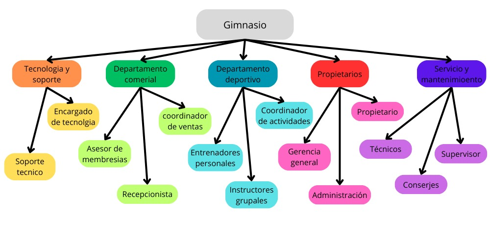
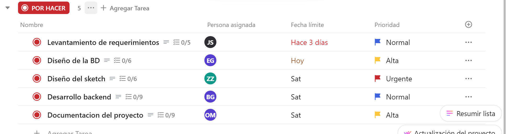
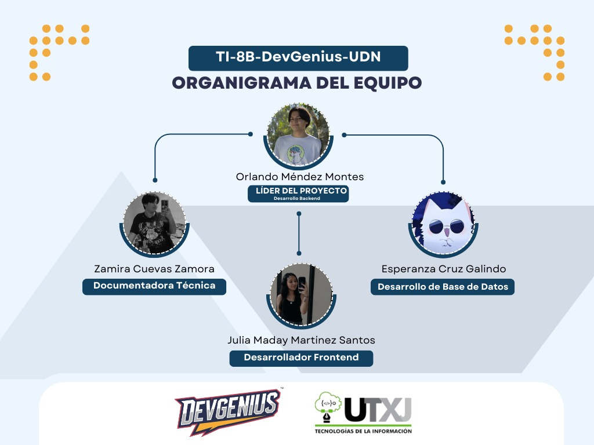

# TI-8B-DevGenius-UDN
## Proyecto Integrador de un gimnasio (GYMBULLS)

### Logos
| Logo Gimnasio | Logo de Equipo |
|--------------|--------------|
|  |  |

### Organigrama del Equipo DevGenius

## Colaboradores

| Colaborador | Perfil | Contribuciones |
|------------|--------|---------------|
| **Orlando Méndez Montes** | [Perfil Orlando](ruta/perfil_amauri) | Líder del Proyecto, Desarrollador Backend |
| **Zamira Cuevas Zamora** | [Perfil Zamira](ruta/perfil_alina) | Documentadora Técnica |
| **Julia Maday Martínez Santos** | [Perfil Julia](ruta/perfil_carballo) | Desarrollador Frontend |
| **Esperanza Cruz Galindo** | [Perfil Esperanza](ruta/perfil_arroyo) | Desarrollo de Base de Datos |

---
# Gym Bulls - Contexto del Negocio

**Gym Bulls** es un centro de entrenamiento dedicado a ofrecer una experiencia de fitness única para personas de todas las edades y niveles. Nos enfocamos en proporcionar entrenamientos personalizados, clases grupales motivadoras y un ambiente de apoyo donde cada miembro pueda alcanzar sus objetivos de salud y bienestar. Nuestro enfoque integral combina tecnología, capacitación continua y un equipo de profesionales apasionados para ofrecer un servicio de calidad superior.

### Misión

En **Gym Bulls**, nuestra misión es ser el líder en soluciones de fitness personalizadas, ofreciendo programas de entrenamiento de alto rendimiento adaptados a las necesidades de cada miembro. Buscamos fomentar un estilo de vida saludable a través de entrenamientos efectivos, apoyo constante y un ambiente inclusivo que inspire a cada persona a superar sus límites.

### Visión

Convertirnos en el gimnasio más innovador y reconocido de la región, destacándonos por nuestra tecnología avanzada, equipos de alta calidad y atención al cliente excepcional. Aspiramos a ser un referente en la industria del fitness, promoviendo no solo la salud física, sino también el bienestar emocional de nuestros miembros.

### Valores

- **Compromiso**: Nos comprometemos a ofrecer entrenamientos de calidad, atención personalizada y un ambiente de respeto mutuo.
- **Innovación**: Estamos constantemente adoptando nuevas tecnologías y métodos de entrenamiento para mantener a nuestros miembros a la vanguardia del fitness.
- **Empoderamiento**: Creemos que cada persona tiene el poder de transformar su vida. Nuestro equipo está aquí para apoyar y motivar a nuestros miembros a alcanzar sus metas.
- **Pasión**: Cada día, ponemos todo nuestro esfuerzo y dedicación en ayudar a nuestros miembros a ser la mejor versión de sí mismos.

### ¿Por qué elegir **Gym Bulls**?

En **Gym Bulls**, somos más que un gimnasio: somos tu compañero en el viaje hacia una vida más activa y saludable. Nos destacamos por nuestra atención al detalle, el enfoque personalizado en cada entrenamiento y nuestra tecnología de punta que permite un seguimiento constante de tu progreso. Nuestros entrenadores son expertos altamente capacitados, comprometidos con tu éxito y siempre disponibles para ayudarte a alcanzar tus metas, sin importar cuán grandes sean.

Con un sistema integral de gestión que conecta todos los aspectos de nuestra operación, desde la planificación de entrenamientos hasta el servicio al cliente y la administración de recursos, garantizamos que tu experiencia con nosotros sea fluida, eficiente y siempre en crecimiento. En **Gym Bulls**, tu salud y satisfacción son nuestra prioridad.

# Organigrama de Gym Bulls

# Planteamiento del problema. 

En la actualidad, muchas personas enfrentan dificultades para mantener un estilo de vida saludable debido a la falta de tiempo, motivación y acceso a entrenamientos adecuados. A pesar de la creciente conciencia sobre la importancia del ejercicio físico, la falta de planos de entrenamiento personalizados, asesoramiento profesional y herramientas tecnológicas efectivas limita el progreso y los resultados de quienes buscan mejorar su condición física, es necesario desarrollar un gimnasio que no solo proporcione acceso a equipos e instalaciones de calidad, sino que también integre programas de entrenamiento personalizados, tecnologías de monitoreo del rendimiento y un ambiente motivador que fomente la constancia y el bienestar general de los usuarios.

# Propuesta de solucion 

Para mejorar la efectividad y personalización de los entrenamientos en el gimnasio, proponemos el diseño e implementación de un sistema digital de entrenamiento que permita optimizar el desarrollo de rutinas, el seguimiento del progreso y la interacción entre entrenadores y usuarios. Este sistema facilitará la planificación de entrenamientos personalizados, centralizará la información de los clientes y proporcionará herramientas para la supervisión del rendimiento en tiempo real.

# Módulo de entrenamiento

El módulo de entrenamiento será el eje central del sistema, permitiendo la planificación y personalización de rutinas para cada usuario. Contará con un panel de control intuitivo, métricas de desempeño e informes de progreso para optimizar el rendimiento. Este módulo facilitará la asignación de entrenadores, la gestión de sesiones y la adaptación de entrenamientos, mejorando la experiencia y resultados de los usuarios.

# Objetivo General  
Desarrollar un gimnasio innovador y accesible que promueva el bienestar físico y mental de sus miembros, ofreciendo instalaciones de alta calidad, entrenamientos personalizados y tecnología avanzada para el monitoreo del progreso, con un enfoque en la motivación, la salud integral y la comunidad fitness.

# Objetivos Específicos 

1.	Desarrollar programas de entrenamiento personalizados según los objetivos individuales de cada usuario, ya sea para pérdida de peso, ganancia muscular, resistencia o rehabilitación.
2.	Implementar técnicas de entrenamiento funcional que mejoren la movilidad, fuerza y resistencia, adaptándose a distintos niveles de condición física.
3.	Incorporar tecnología para el monitoreo del rendimiento , como aplicaciones, wearables y análisis de datos, para optimizar los entrenamientos y el progreso de los usuarios.
4.	Fomentar la educación en entrenamiento y nutrición mediante asesorías, talleres y material informativo, promoviendo un enfoque integral del bienestar.
5.	Optimizar el uso de equipos y espacios del gimnasio , asegurando su disponibilidad y mantenimiento adecuado para una experiencia segura y eficiente.
6.	Capacitar a los usuarios sobre técnicas correctas de entrenamiento y recuperación para maximizar resultados y minimizar riesgos de lesiones.
7.	Crear un ambiente motivador y comunitario donde los usuarios encuentren apoyo en entrenadores y compañeros para alcanzar sus metas.

## Lista de tecnologías

### Frontend

### Backend

### Base de Datos

# Diagrama de Gantt

# Organigrama del equipo 

El equipo de desarrollo está compuesto por profesionales con roles definidos que garantizan el éxito del proyecto mediante la colaboración y especialización en distintas áreas clave.

- Líder del Proyecto (Desarrollador Backend): 
Responsable de la dirección general del proyecto, asegurando que se cumplan los objetivos y plazos establecidos. Además, se encarga del desarrollo de la lógica del servidor, la implementación de APIs y la gestión de la seguridad del sistema.
- Desarrollador Backend:
Encargado de la construcción y mantenimiento de la lógica del negocio, la optimización del rendimiento del servidor y la integración con bases de datos y servicios externos.
- Documentadora Técnica:
Responsable de la creación y mantenimiento de la documentación técnica del proyecto, incluyendo manuales de usuario, guías de instalación, diagramas y especificaciones de software.
- Desarrollador de Base de Datos:
Diseña, optimiza y gestiona las bases de datos del sistema, asegurando la integridad, seguridad y eficiencia en el almacenamiento y recuperación de datos.

Desarrollador Frontend:
Se encarga de la implementación de la interfaz de usuario, asegurando que el diseño sea atractivo, funcional y accesible. Trabaja con tecnologías como HTML, CSS y JavaScript para brindar una experiencia óptima a los usuarios.

