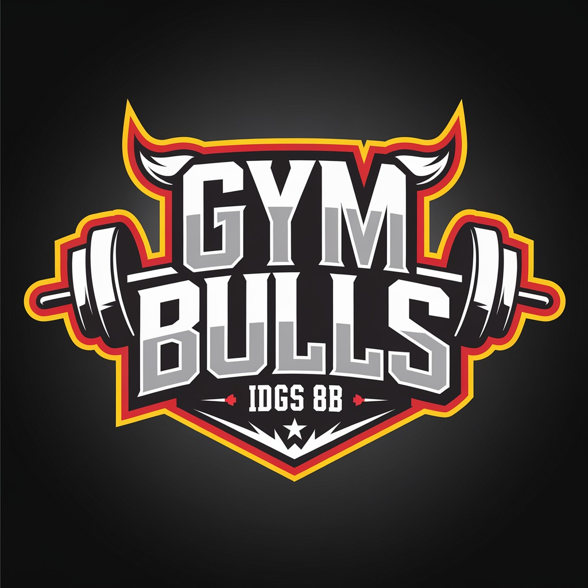
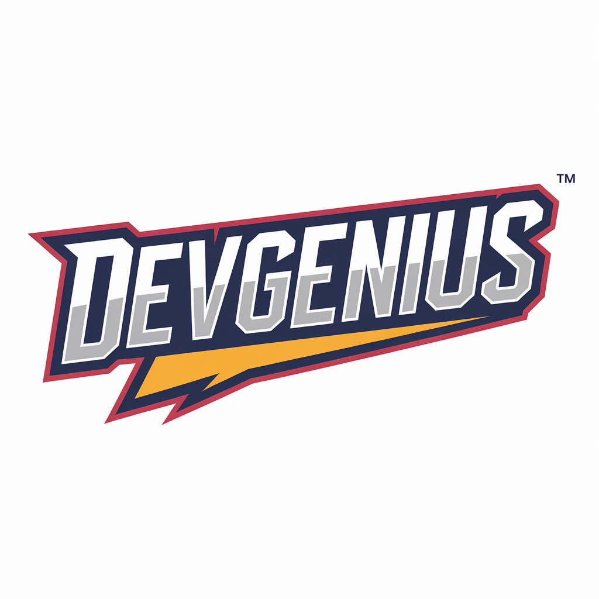

=======
# TI-8B-DevGenius-UDN
## Proyecto Integrador de un gimnasio (GYMBULLS)

### Logos
| Logo Gimnasio | Logo de Equipo |
|--------------|--------------|
|  |  |

### Organigrama del Equipo

## Colaboradores

| Colaborador | Perfil | Contribuciones |
|------------|--------|---------------|
| **Orlando Méndez Montes** | [Perfil Orlando](ruta/perfil_amauri) | Líder del Proyecto, Desarrollador Backend |
| **Zamira Cuevas Zamora** | [Perfil Zamira](ruta/perfil_alina) | Documentadora Técnica |
| **Julia Maday Martínez Santos** | [Perfil Julia](ruta/perfil_carballo) | Desarrollador Frontend |
| **Esperanza Cruz Galindo** | [Perfil Esperanza](ruta/perfil_arroyo) | Desarrollo de Base de Datos |

---
# Gym Bulls - Contexto del Negocio

**Gym Bulls** es un centro de entrenamiento dedicado a ofrecer una experiencia de fitness única para personas de todas las edades y niveles. Nos enfocamos en proporcionar entrenamientos personalizados, clases grupales motivadoras y un ambiente de apoyo donde cada miembro pueda alcanzar sus objetivos de salud y bienestar. Nuestro enfoque integral combina tecnología, capacitación continua y un equipo de profesionales apasionados para ofrecer un servicio de calidad superior.

### Misión

En **Gym Bulls**, nuestra misión es ser el líder en soluciones de fitness personalizadas, ofreciendo programas de entrenamiento de alto rendimiento adaptados a las necesidades de cada miembro. Buscamos fomentar un estilo de vida saludable a través de entrenamientos efectivos, apoyo constante y un ambiente inclusivo que inspire a cada persona a superar sus límites.

### Visión

Convertirnos en el gimnasio más innovador y reconocido de la región, destacándonos por nuestra tecnología avanzada, equipos de alta calidad y atención al cliente excepcional. Aspiramos a ser un referente en la industria del fitness, promoviendo no solo la salud física, sino también el bienestar emocional de nuestros miembros.

### Valores

- **Compromiso**: Nos comprometemos a ofrecer entrenamientos de calidad, atención personalizada y un ambiente de respeto mutuo.
- **Innovación**: Estamos constantemente adoptando nuevas tecnologías y métodos de entrenamiento para mantener a nuestros miembros a la vanguardia del fitness.
- **Empoderamiento**: Creemos que cada persona tiene el poder de transformar su vida. Nuestro equipo está aquí para apoyar y motivar a nuestros miembros a alcanzar sus metas.
- **Pasión**: Cada día, ponemos todo nuestro esfuerzo y dedicación en ayudar a nuestros miembros a ser la mejor versión de sí mismos.

### ¿Por qué elegir **Gym Bulls**?

En **Gym Bulls**, somos más que un gimnasio: somos tu compañero en el viaje hacia una vida más activa y saludable. Nos destacamos por nuestra atención al detalle, el enfoque personalizado en cada entrenamiento y nuestra tecnología de punta que permite un seguimiento constante de tu progreso. Nuestros entrenadores son expertos altamente capacitados, comprometidos con tu éxito y siempre disponibles para ayudarte a alcanzar tus metas, sin importar cuán grandes sean.

Con un sistema integral de gestión que conecta todos los aspectos de nuestra operación, desde la planificación de entrenamientos hasta el servicio al cliente y la administración de recursos, garantizamos que tu experiencia con nosotros sea fluida, eficiente y siempre en crecimiento. En **Gym Bulls**, tu salud y satisfacción son nuestra prioridad.

# Organigrama de Gym Bulls

